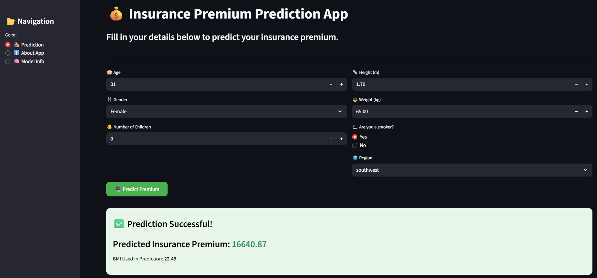

# 🩺 Insurance Premium Prediction System

---

## 🧠 About the Project

The **Insurance Premium Prediction System** is a complete end-to-end **Machine Learning web application** that predicts the **insurance premium amount** an individual needs to pay based on their personal and lifestyle details — such as age, gender, BMI, smoking status, number of children, and region.

This project includes:
- ⚡ **FastAPI** backend (REST API for predictions)  
- 🎨 **Streamlit** frontend (interactive UI)  
- 🐳 **Dockerized** backend and frontend containers  
- ☁️ **Deployed on Render Cloud**

---

## 🚀 Live Links

🔹 **Frontend App (Streamlit):** [Insurance Premium Prediction System](https://insurance-premium-prediction-system.onrender.com/)  
🔹 **Backend API (FastAPI):** [Insurance Premium Prediction API](https://insurance-premium-prediction-api-2.onrender.com/predict)

---

## 🖼️ Application Preview

> *(Ensure your screenshot is saved at `assets/frontend.png`)*

---

## 🎯 Objective

To design, develop, and deploy a **production-ready machine learning pipeline** that integrates:
- Model development & evaluation  
- Backend API for predictions  
- Frontend for user interaction  
- Containerization & deployment on cloud  

---

## ⚙️ Tech Stack

| Layer | Technology Used |
|:------|:----------------|
| **Programming Language** | Python 3.10+ |
| **Model** | Gradient Boosting Regressor |
| **Backend Framework** | FastAPI |
| **Frontend Framework** | Streamlit |
| **Containerization** | Docker |
| **Deployment** | Render Cloud |
| **Version Control** | Git & GitHub |

---

### 🔹 Notes:
- **Model/**: Contains Jupyter notebooks for EDA, preprocessing, trained models, and raw dataset.  
- **app/**: FastAPI backend code.  
- **frontend/**: Streamlit UI, assets, and Dockerfile for frontend deployment.  
- **Dockerfile**: Root Dockerfile if you are combining backend and frontend in one container.  
- **venv/**: Local virtual environment (ignored in Git).  
- **requirements.txt**: Lists all Python dependencies needed for the project.  

---

## 🧠 Model Development (ML Part)

- Dataset: `https://www.kaggle.com/datasets/noordeen/insurance-premium-prediction`  
- ML Algorithm: **Gradient Boosting Regressor**  
- Achieved **R² Score: 0.87**  
- Data preprocessing steps:
  - Handled categorical variables (`sex`, `smoker`, `region`) using **OneHotEncoder**
  - Scaled numerical columns (`age`, `bmi`, `children`) using **StandardScaler**

---

## 🔁 API Example

### Request
json
{
  "age": 14,
  "sex": "male",
  "height": 1.50,
  "weight": 30,
  "children": 0,
  "smoker": "no",
  "region": "southwest"
}

Response

{
  "predicted_premium": 1164.05,
  "calculated_bmi": 13.33
}

#### 🧰 Run Locally (Optional)
- Clone the Repository
- git clone https://github.com/kavyapatel08/Insurance-Premium-Prediction-System.git
- cd Insurance-Premium-Prediction-System

#### Create Virtual Environment
- python -m venv venv
- source venv/Scripts/activate      # (for Windows)

#### Install Dependencies
- pip install -r requirements.txt

#### Run FastAPI (Backend)
- cd app
- uvicorn main:app --reload

Open 👉 http://localhost:8000/docs

#### Run Streamlit (Frontend)
- cd frontend
- streamlit run app_ui.py

#### 👩‍💻 Author

##### Kavya Patel
- 💼 Machine Learning & AI Enthusiast
- 📧 https://www.linkedin.com/in/kavya-200o/

#####⭐ Support

- If you found this project helpful, please ⭐ star this repo and share it!
- Feedback, forks, and suggestions are always welcome 💬

🏁 Conclusion

- This project demonstrates the end-to-end ML workflow — from model building and API creation to Dockerization and deployment.

